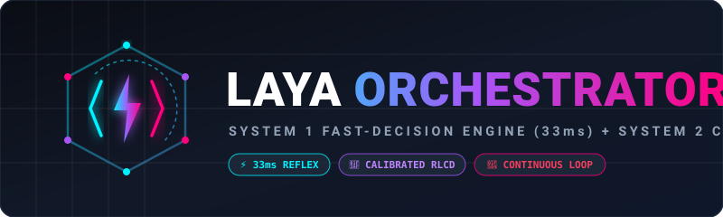

<p>
  
</p>

<p align="center">
  <a href="https://huggingface.co/convaiinnovations/laya"></a>
  <a href="https://github.com/astral-sh/uv"></a>
  <a href="https://www.python.org/downloads/"></a>
  <a href="#license"></a>
  
</p>

---

## ⚡ Overview

**Laya Orchestrator** is an autonomous software development orchestrator built on the **System 1 (Laya) + System 2 (Code Generator)** architecture.

Inspired by real-time AI agents capable of playing **Doom** and **Minecraft** at 30 FPS, this project brings that same low-latency continuous decision loop to software engineering:

* **System 1 (Laya - 33ms):** A non-autoregressive encoder ([convaiinnovations/laya](https://huggingface.co/convaiinnovations/laya)) trained with **RLCD** (Reinforcement Learning from Calibrated Decisions). It performs fast, zero-token, mathematically calibrated decisions on code state (bug triage, action routing, acceptance verification).
* **System 2 (Execution / Code LLM):** Heavy generative models (Claude Code, Qwen2.5-Coder, DeepSeek-Coder, or Ollama) invoked only when code synthesis is explicitly commanded by Laya.

```
┌────────────────────────────────────────────────────────────────────────┐
│                        THE ARCHITECT (Claude Code)                     │
│        Analyzes requirements, designs system, creates plan.yaml        │
└───────────────────────────────────┬────────────────────────────────────┘
                                    │
                                    ▼
┌────────────────────────────────────────────────────────────────────────┐
│                 CONTINUOUS AUTONOMOUS LOOP (Stile Doom/Gaming)         │
│                                                                        │
│       ┌────────────────────────────────────────────────────────┐       │
│       │ 1. Current State (Files, Criteria, Failure Tracebacks) │       │
│       └───────────────────────────┬────────────────────────────┘       │
│                                   │                                    │
│                                   ▼                                    │
│       ┌────────────────────────────────────────────────────────┐       │
│       │ 2. LAYA (System 1 - 33ms Single Forward Pass)          │       │
│       │    - next_action: implement_code, fix_bug, advance...  │       │
│       │    - step_verified: probability [0.0 - 1.0]            │       │
│       │    - severity: risk / error score                      │       │
│       └───────────────────────────┬────────────────────────────┘       │
│                                   │ Typed Decision                     │
│                                   ▼                                    │
│       ┌────────────────────────────────────────────────────────┐       │
│       │ 3. System 2 Coder & Shell Execution                    │       │
│       │    - Generates/fixes source files                      │       │
│       │    - Runs automated pytest / linter verification       │       │
│       └───────────────────────────┬────────────────────────────┘       │
│                                   │ Output / Traceback                 │
│                                   ▼                                    │
│       └─────────────────► Feeds back into Step 1 ◄─────────────────────┘
```

---

## 📊 Why System 1 + System 2?

Traditional agentic frameworks invoke giant 70B+ LLMs for every tiny routing decision ("Did this test pass?", "What tool next?"). This is slow, expensive, and prone to hallucinated loops.

| Feature | Pure Autoregressive LLM Agent | Laya Hybrid Orchestrator |
| :--- | :--- | :--- |
| **Routing Decision Time** | 1,500 ms – 4,000 ms per step | **~33 ms** (Single forward pass) |
| **Routing Token Cost** | Thousands of prompt/completion tokens | **0 Tokens** (`output_tokens: 0`) |
| **Decision Output** | Unstructured verbose text | **Strictly Typed** (`choice`, `score`, `noul`) |
| **Calibration** | Frequently overconfident hallucinations | **Mathematically Calibrated Probabilities** |
| **Gaming & Continuous Loops** | Too slow for real-time reflexes | **Native 30 FPS continuous reflex speed** |

---

## 🚀 Quick Start

### 1. Installation

The project is packaged for ultra-fast setup using [uv](https://github.com/astral-sh/uv) or standard `pip`:

```bash
# Clone the repository
git clone https://github.com/username/laya-orchestrator.git
cd laya-orchestrator

# Create venv and install
uv venv .venv
source .venv/bin/activate
uv pip install -e .
```

### 2. Run an Autonomous Plan

Execute a plan file (`.yaml`, `.json`, or `.md`):

```bash
laya-orchestrator examples/auth_plan.yaml
```

Output in real time:
```text
╭──────────────────────────────────────────────────────────────────────────────╮
│ Starting Laya Autonomous Orchestrator                                        │
│ Plan: User Authentication Service (2 steps)                                  │
╰──────────────────────────────────────────────────────────────────────────────╯
         Cycle 1 | Active:  Implement Password Hashing          
┏━━━━━━━━━━━━━━━┳━━━━━━━━━━━━┳━━━━━━━━━━━━━━━━━━━━━━┳━━━━━━━━━━┓
┃ Laya Decision ┃ Confidence ┃ Step Verified (noul) ┃ Severity ┃
┡━━━━━━━━━━━━━━━╇━━━━━━━━━━━━╇━━━━━━━━━━━━━━━━━━━━━━╇━━━━━━━━━━┩
│ implement_code│     68.40% │               23.10% │     0.80 │
└───────────────┴────────────┴──────────────────────┴──────────┘
⚡ System 2 executing: implement_code on ['auth/security.py']...
🧪 Running verification command: python3 -c 'import sys; sys.exit(0)'
✔ Verification PASSED!
✔ Advancing to next step...
```

---

## 🛠 Plan Structure (`plan.yaml`)

Claude Code (or your architect agent) can generate declarative plans that Laya executes:

```yaml
title: "JWT Authentication & User Service"
description: "Implement secure password hashing and token generation"
target_directory: "./src"
steps:
  - id: "step-1-hasher"
    title: "Implement Password Hashing"
    description: "Create hash_password and verify_password using argon2/bcrypt"
    files_to_modify:
      - "auth/security.py"
    verification_command: "pytest tests/test_security.py"
    acceptance_criteria:
      - "Hashes password with random salt"
      - "Verifies valid password returns True"

  - id: "step-2-jwt"
    title: "Generate and Validate JWT"
    description: "Create encode_token and decode_token handlers"
    files_to_modify:
      - "auth/jwt_handler.py"
    verification_command: "pytest tests/test_jwt.py"
    acceptance_criteria:
      - "Tokens expire after 3600 seconds"
      - "Invalid signatures raise AuthenticationError"
```

---

## 🤖 Configuring Code Generation (System 2)

By default, Laya Orchestrator uses a deterministic code scaffold generator. To connect it to your favorite LLM for full code generation, simply set environment variables:

### Option A: Local LLMs (Ollama / vLLM / LM Studio)
Run 100% offline at zero API cost:
```bash
export OPENAI_BASE_URL="http://localhost:11434/v1"
export LLM_MODEL="qwen2.5-coder:7b"
export OPENAI_API_KEY="dummy"
```

### Option B: Cloud Providers (OpenAI, OpenRouter, Claude)
```bash
export OPENAI_BASE_URL="https://api.openai.com/v1"
export OPENAI_API_KEY="sk-..."
export LLM_MODEL="gpt-4o-mini"
```

---

## 🔄 The Laya Decision Engine (System 1)

Laya uses non-autoregressive encoder classification heads over `answerdotai/ModernBERT-large`:

```python
from laya_orchestrator.core.decision_engine import LayaDecisionEngine

engine = LayaDecisionEngine()
decision = engine.evaluate_state("""
PROJECT PLAN: Add Authentication
ACTIVE STEP: Run tests
LATEST FAILURE: KeyError: 'secret_key' in auth/jwt_handler.py:18
""")

print(decision.action)              # -> "fix_bug"
print(decision.action_confidence)   # -> 0.78
print(decision.severity_score)      # -> 1.45 (Moderate bug)
print(decision.step_verified_prob)  # -> 0.12 (Not verified)
```

---

## 🎯 Fine-Tuning with RLCD

Every execution cycle records its state and decisions into telemetry traces. You can export these to fine-tune Laya specifically for your engineering pipeline:

```python
from laya_orchestrator.finetuning.dataset_generator import DevDecisionDatasetGenerator

# Export dataset of software decisions
count = DevDecisionDatasetGenerator.export_dataset("datasets/dev_decisions.jsonl")
print(f"Exported {count} calibrated samples for fine-tuning.")
```

Run fine-tuning locally or on a free GPU (Kaggle/Colab T4) using the provided guide in `laya_orchestrator/finetuning/finetune_guide.py`.

---

## 📁 Repository Structure

```
laya-orchestrator/
├── assets/
│   └── logo.svg                 # Project banner and emblem
├── examples/
│   ├── auth_plan.yaml           # End-to-end authentication plan
│   └── bug_plan.yaml            # Test plan with intentional bug triage
├── laya_orchestrator/
│   ├── __init__.py
│   ├── cli.py                   # Typer CLI application
│   ├── core/
│   │   ├── decision_engine.py   # Laya System 1 wrapper & questions
│   │   ├── orchestrator.py      # Autonomous execution loop
│   │   └── plan.py              # Plan & Step data models (.yaml, .json, .md)
│   ├── executors/
│   │   ├── base.py              # Abstract Executor interface
│   │   ├── code_engine.py       # System 2 code generator (Local/API)
│   │   └── shell_executor.py    # Shell verification runner
│   └── finetuning/
│       ├── dataset_generator.py # RLCD calibrated dataset builder
│       └── finetune_guide.py    # Fine-tuning guide and notebook exporter
├── tests/                       # Unit and integration test suite
├── pyproject.toml               # Hatchling build specification
├── README.md                    # Documentation
└── LICENSE                      # MIT License
```

---

## 📄 License

Distributed under the **MIT License**. See `LICENSE` for more information.
